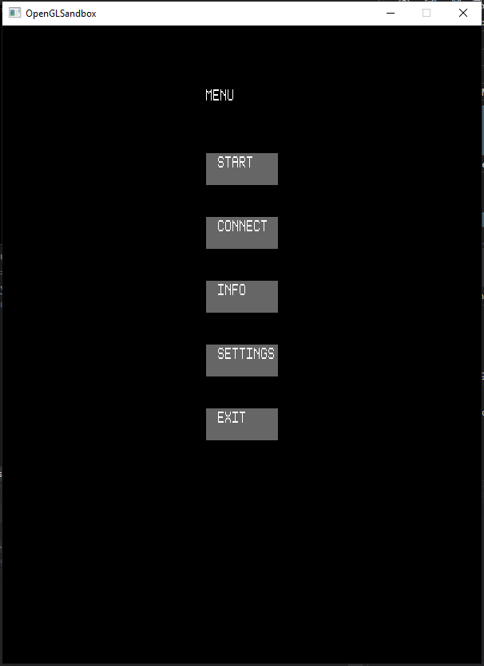
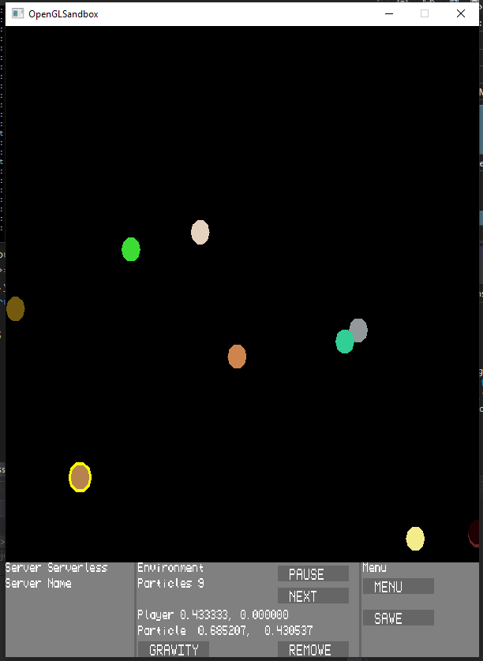
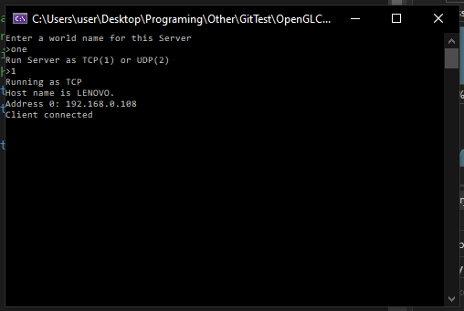
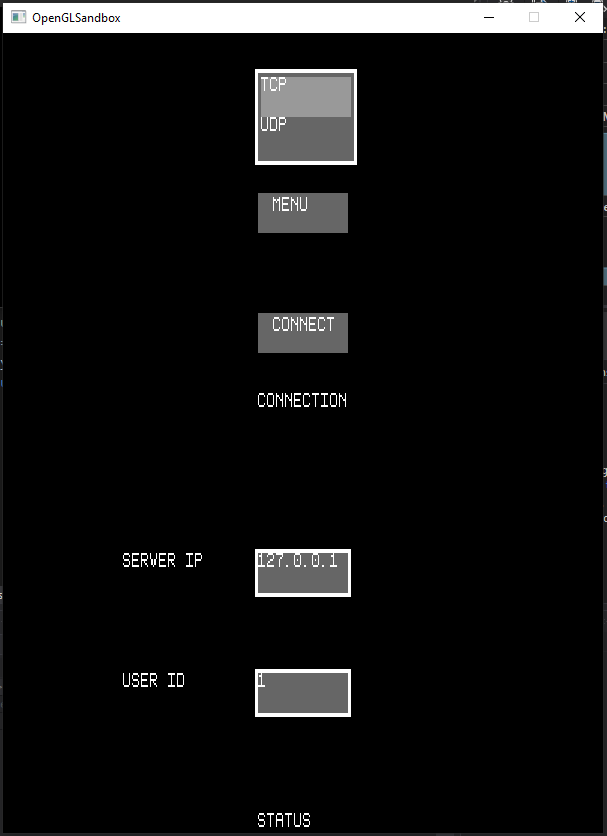
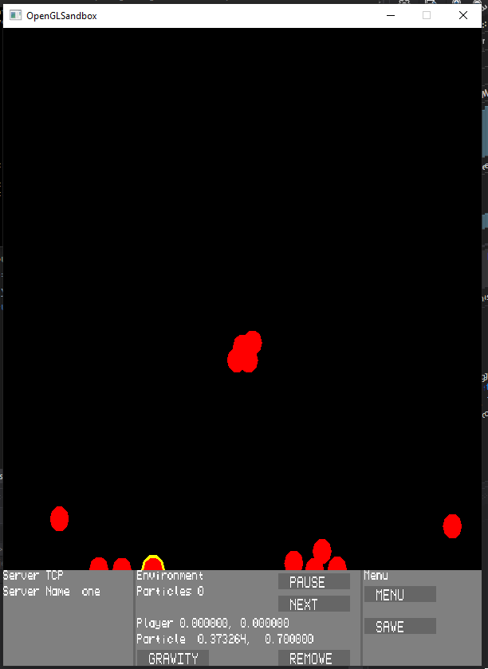

# OpenGLClient
OpenGL Client and Server physics simulator Application.

In order to build solution, confirm that you are building project in Debug-x86 Solution Configuration

Multiplayer only works on LAN. To run multiplayer, run the Physics Server program and select TCP or UDP. After the server starts, the IP address of the server will be displayed. Then run the Physics client. Go to Connect, select the TCP/UDP mode to match the server, enter the correct IP address and a unique ID if using UDP connection.

This application is a 2d physics simulator written in C++ that renders using the OpenGL Library. The application in made up of 2 solutions, the Client Solution (PhysicsClient2) and the Server solution (PhysicsServer). 

The client solution allows a user to run the simulation in single-user mode and multi-user mode. to run single-user mode, the user can click the "START" button in the menu page and then click the "NEW" with starts the simulation. In the simulation, the user can control a particle with the keyboard arrow keys, add new particles by left-clicking on the screen, in the HUD they can select particles using the "NEXT" button, remove the selected button, pause the simulation, and toggle gravity. The user can exit the simulation by clicking the "MENU" button. During the simulation, the particles will fall with gravity if it is enabled and bounces off of other particles and off the borders of the window.

In multi-user mode, the user can connect to a server and to view the particles in the server along. Other user's can connect to a server if they are on the same LAN. Before a user can connect to a Server, the Server can be started with the Server with the PhysicsServer solution where the user will be prompted to enter a name for the server and to select if the Sever will run in TCP or UDP mode. When the server starts successfully, the IP address of the server will be displayed so other users can reference the server IP for connection. In TCP, when clients connect/disconnect, the console will be display a message.

To connect to a server, in the menu page, the user can click the "CONNECT" button to enter the connect page. In The connect page, the user can select TCP or UDP, enter the IP of the Server, and enter a unique user ID if they are using UDP. If there is an issue connecting to the server then the status on the button of the page will be updated notifying the user why there was an issue. Once the user successfully connects to a server, they can control the environment similar to how they can control it in single player.

The PhysicsClient2 solution is made using OpenGL, all rendering is handing using a shader for polygons and a shader for images. The data for rendering is stored in VBO (Vertex Buffer object) and VAO (Vertex Array Object) to represents triangles which are sent to shaders to render using the device GPU. The game is contained in a GLFW window which listens to mouse and key input. All UI is custom build which includes components such as Button, TextField, TextInput, and RadioButton. Strings are rendered by drawing an image of each string character which is loaded from a PNG resource.

The PhysicsServer solution works in 2 threads, one thread to constantly update the server particles at 60 ticks per second and a second thread to handle the server-client communications such as listening for a client, processing client messages and sending messages to clients by using Winsock and WS2tcpip.h.

This application is still a work in progress and has planned future features such as optimization so running the applications consumes less CPU, 3d rendering, more physics topics beyond particle physics, more refined UI elements that feel intuitive and smooth. Capability to save and load previous simulations, and more setting for using configurations.

